# TrenoLEGO
Advanced Hub for old (4.5V) and modern LEGO trains

<p align="center">
  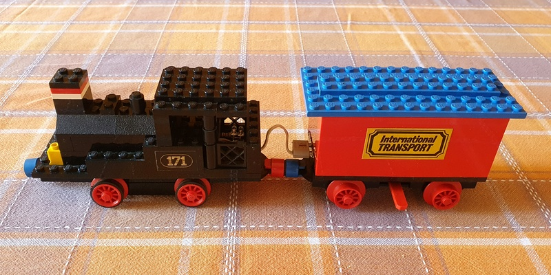
  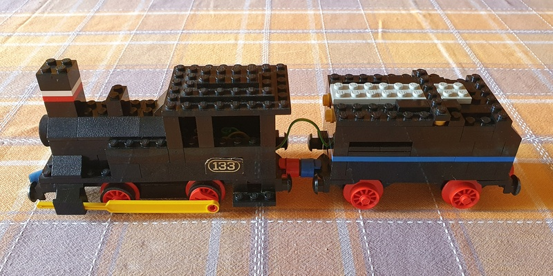
</p>
<p align="center">
  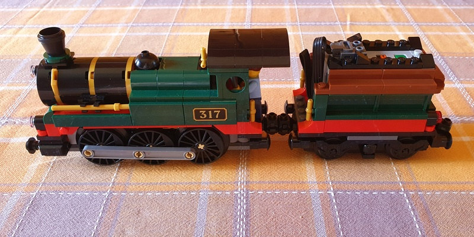
  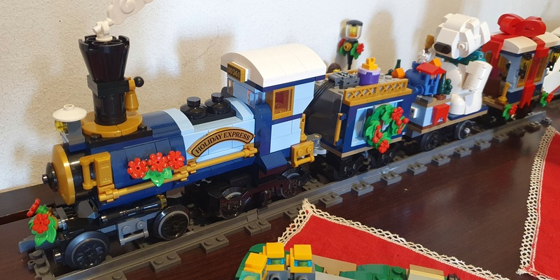
</p>

## 1. Introduction  
*TrenoLEGO* is a complete control hub for both vintage 4.5V and modern LEGO trains, offering a range of advanced features. It is based on ESP32 and ESP8266 MCUs and it was successfully tested with ESP32 S3 SuperMini, ESP32 C3 SuperMini Plus and NodeMCU 1.0/ESP8266 (with some limitations due to small quantity of RAM).  
The main features are:

- Support for old *4.5V motors* (but you can increase the power up to 6-6.5V without burning the MCU).
- Rechargable Li-ion battery.
- *PoweredUp* emulation: *TrenoLEGO* can be configured as a real PoweredUp hub and can be connected with LEGO controllers and
  *PoweredUp App*.
- Possibility to control up to 4 *Power Functions* trains by optional IR transmitter. 
- Sound effects and music.
- Soft start/stop to simulate acceleration and breaking.
- Support for *Bluetooth* controllers (they cannot connected directly to *TrenoLEGO*, but through the phone/tablet/PC. 
- *Philips Hue emulation* for Alexa/Amazon Echo voice commands (e.g. "Alexa, Holiday Express 50%").
- *MQTT client*, which can be used to control trains by your smart home system (e.g. openHAB, Home Assistant, etc.) 
- Battery monitoring system (BMS) to prevent the overdischarge of the battery and to check the residual capacity.
- *Telnet server* for remote configuration/debug.
- *FTP server* for GUI file update without rebuild the firmware.
- *On-The-Air* (OTA) update via web and Arduino OTA.
- Automatic language localization (*english* and *italian* supported).
- Speech synthesis.

Here is a short video presenting the main features of *TrenoLEGO* hub:

<p align="center">
  <a href="https://youtu.be/Lw-Lzx7ifEI">
    
  </a><br>
  <i>Click the image to watch the video on YouTube.</i>
</p>
  
## 2. Hardware requirements
All the hardware components were purchased from *AliExpress*. Pictures of the various components are provided below to help you identify suitable alternatives if you prefer to buy them from other online stores.

- **ESP32 S3 SuperMini or ESP32 C3 SuperMini Plus or NodeMCU 1.0**  
  The ESP32 C3 SuperMini Plus is preferred because it is small, inexpensive, and provides stable Wi-Fi and BLE connections. Moreover, the onboard connector allows an external antenna to be connected, extending the operating range. Although the ESP32 S3 SuperMini is more powerful than the C3 version (2 cores and additional PSRAM), it is affected by a poor board design that may result in an unstable connection due to the ceramic antenna being too close to the main chip. The NodeMCU, and ESP8266-based boards in general, do not support BLE and, for this reason, cannot emulate a *PowerUp* hub. Moreover, due to the limited amount of RAM, they cannot run all services at the same time (e.g., FTP, Telnet, MQTT, and Alexa/Hue emulation). For this reason, enable only the services you need.
  <table align="center">
   <tr>
    <td align="center">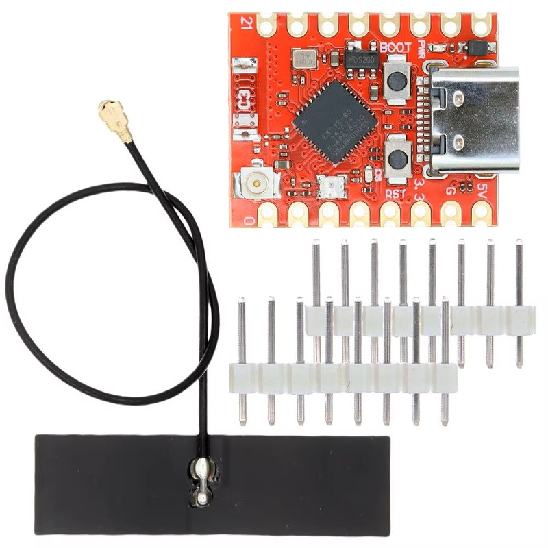</td>
    <td align="center">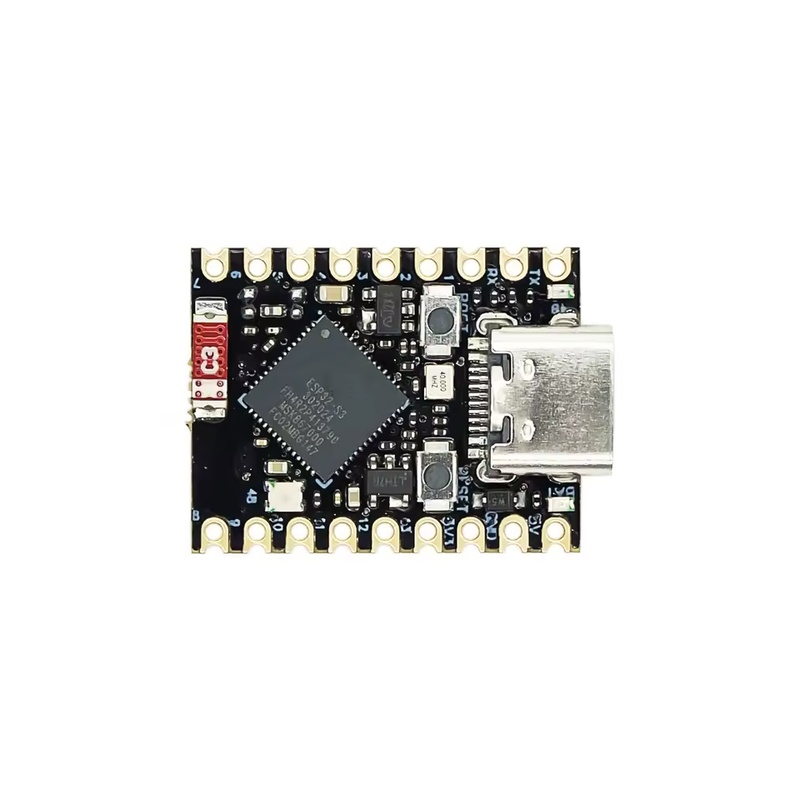</td>
    <td align="center">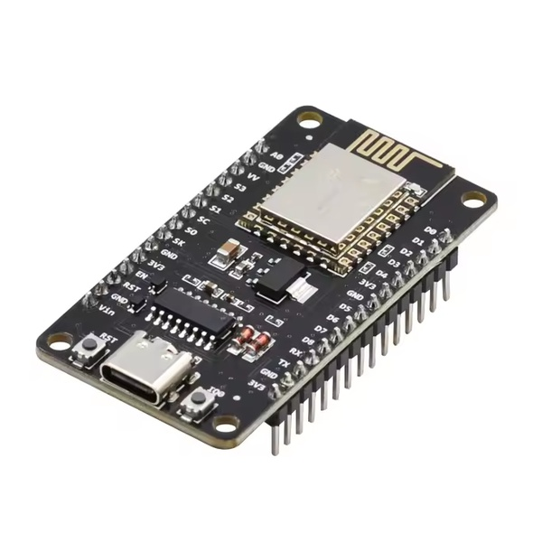</td>
   </tr>
   <tr>
    <td align="center">ESP32 C3 SuperMini Plus</td>
    <td align="center">ESP32 S3 SuperMini</td>
    <td align="center">Node MCU ESP8266</td>
   </tr>
  </table>

- **DRV8833 motor driver**
  This compact motor driver can handle a maximum current of 1.5 A and features two independent channels for controlling two motors.
  <table align="center">
   <tr>
    <td align="center">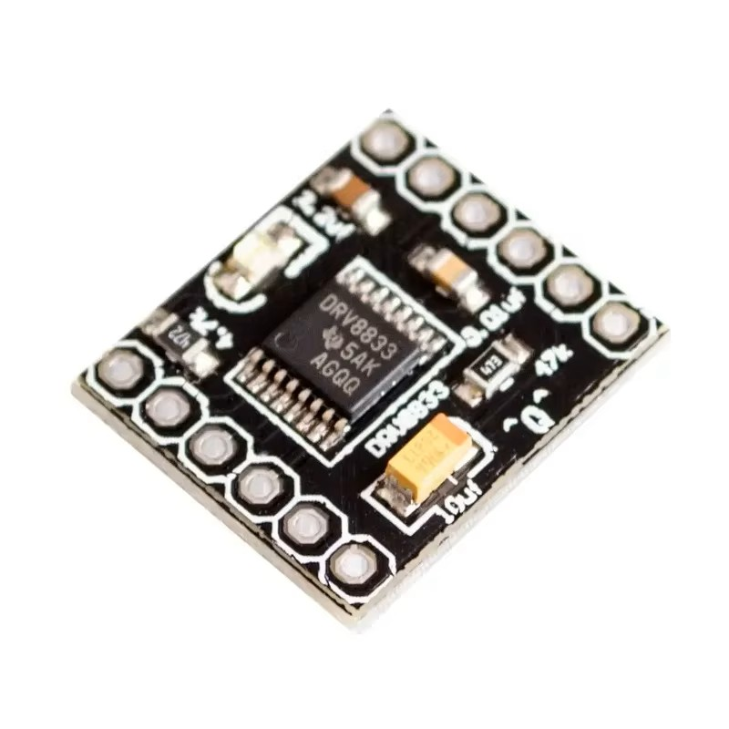</td>
   </tr>
   <tr>
    <td align="center">DRV8233dual channel motor driver</td>
   </tr>
  </table>
  
- **Power bank circuit board**  
  This board must provide a 5 V output with a current of 1–2 A and include the battery charging circuitry. Some boards sold on *AliExpress* have a small trimmer for adjusting the output voltage. If you want to power *LEGO Power Functions* motors or compatible clones, you can increase the output voltage up to 6.5 V.
  <table align="center">
   <tr>
    <td align="center">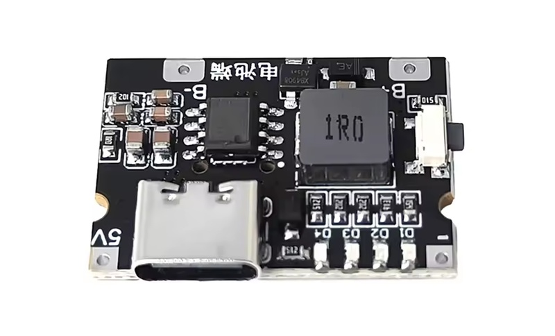</td>
    <td align="center">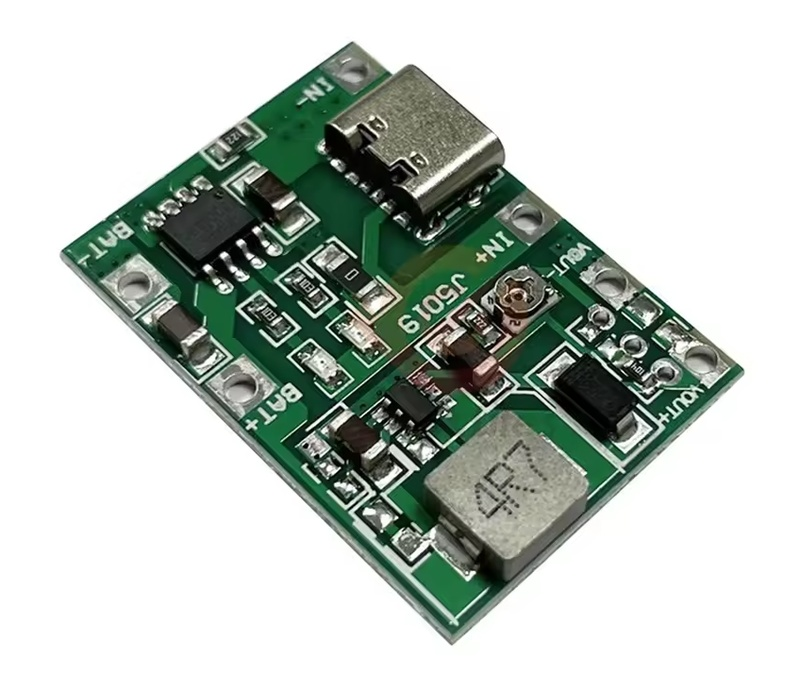</td>
    <td align="center">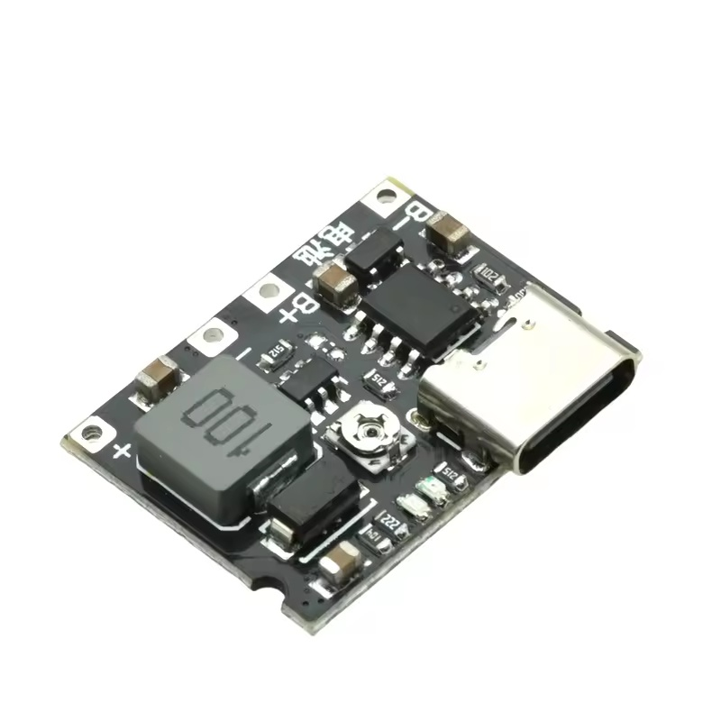</td>
   </tr>
   <tr>
    <td align="center">Fixed 5V 2A board. Perfect to power old 4,5V motors</td>
    <td align="center">5 to 9V adjustable power & charger. This board is perfect to be inserted into LEGO 88000 battery box</td>
    <td align="center">Smaller version on the previous module. Perfect for super-small projects</td>
   </tr>
  </table>
    
  **WARNING:**  
  Do not set the voltage higher than 6.5 V, as this may damage the ESP32's voltage regulator circuit. The NodeMCU may tolerate higher voltages, but this depends on the specific board design and the type of voltage regulator used.
  
- **1N4007 diode or equivalent**  
  This diode is required to protect the MCU and the power bank board when the MCU's USB port is connected to an external power source.
  <table align="center">
   <tr>
    <td align="center">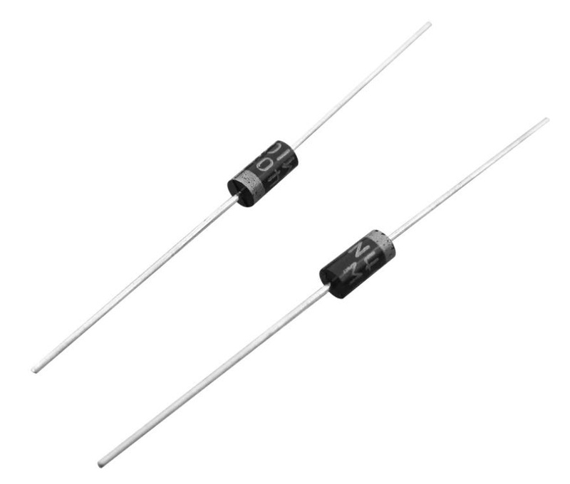</td>
   </tr>
   <tr>
    <td align="center">1N4007 diode</td>
   </tr>
  </table>
  
- **18650 or 14500 3.7 V Li-ion battery**  
  Choose the most suitable battery size according to the available space in the housing. The 18650 is inexpensive, widely available, and offers a high capacity (typically from 1500 to 3500 mAh), but it is relatively large. The 14500 battery is approximately the same size as a standard AA cell, making it suitable for smaller housings (e.g., the *LEGO 88000* 9 V battery box), but it has a lower capacity (typically from 500 to 1500 mAh).
  <table align="center">
   <tr>
    <td align="center">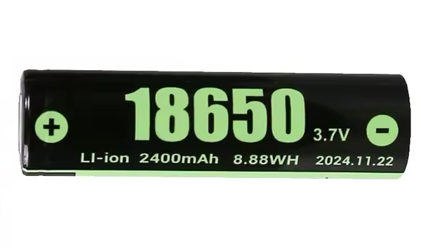</td>
    <td align="center">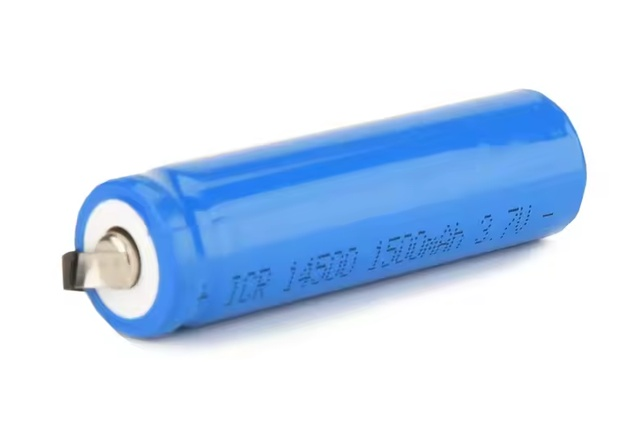</td>
   </tr>
   <tr>
    <td align="center">18650 battery</td>
    <td align="center">14500 battery</td>
   </tr>
  </table>

- **Battery holder/box** (optional)  
  A battery holder is required if you intend to use batteries without solder tabs. One interesting solution is to buy an inexpensive battery box compatible with the *LEGO 88000*. It includes an electronic switch that can be used to turn the MCU on and off, as well as enough space to accommodate one or two 14500 cells. This is probably the best choice if you want a full-size, LEGO-compatible battery box without the need for 3D printing.  
  Another interesting option is to use three AA-to-C battery adapters, which fit inside the old *LEGO 161 battery wagon* in place of the original C batteries. The three adapters can be used to house the 14500 battery, the ESP32 C3 SuperMini, and the power board, respectively. This makes it possible to convert the old *LEGO 161 battery wagon* into a modern, self-contained hub without making any permanent modifications to the original LEGO part.
  
  <table align="center">
   <tr>
    <td align="center">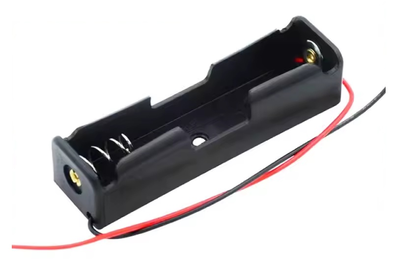</td>
    <td align="center">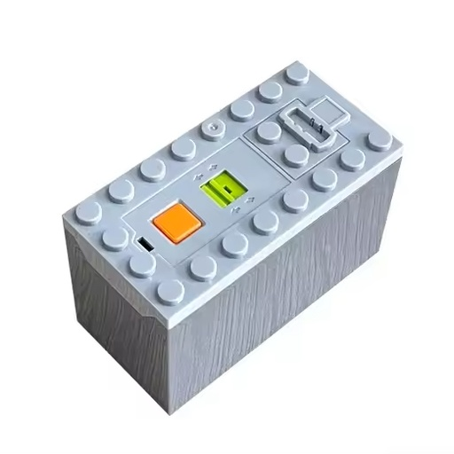</td>
    <td align="center">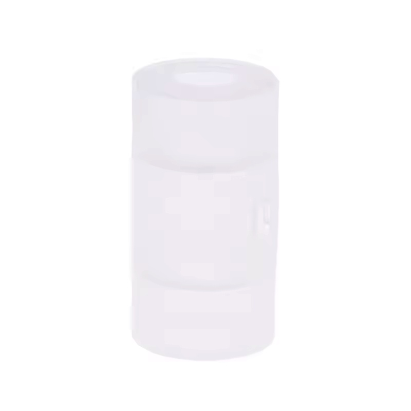</td>
   </tr>
   <tr>
    <td align="center">Battery holder for 18650 cell</td>
    <td align="center">Battery box compatible with LEGO 88000</td>
    <td align="center">AA to C battery adapter. Three of these adapters can fit inside the old LEGO 161 battery vagon</td>
   </tr>
  </table>

- **Switches**
  Two switches are required: the first is used to turn the hub on and off, while the second allows you to switch between *PoweredUp* and Advanced Hub modes. You can reuse the electronic switch included in a *LEGO 88000-compatible battery box*, as it also works perfectly with the ~4 V supplied by the Li-ion battery.  When the battery box is very small, or you prefer not to add an external switch to select the operating mode (e.g., when using a *LEGO 88000-compatible* battery box), you can use a mercury tilt switch instead. Since the state of this switch is checked only when the MCU starts up, you can select *PoweredUp* mode simply by tilting the battery box while pressing the power button.  
  <table align="center">
   <tr>
    <td align="center">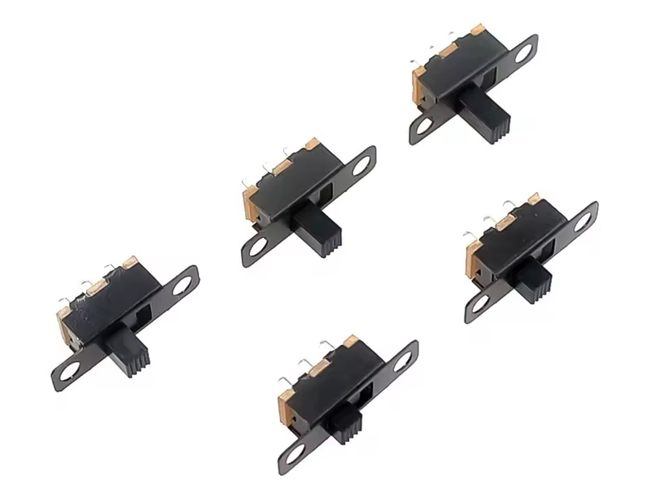</td>
    <td align="center">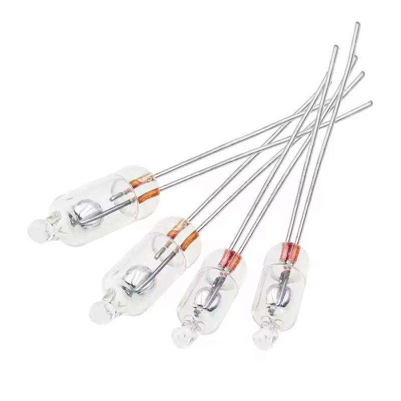</td>
   </tr>
   <tr>
    <td align="center">Switches</td>
    <td align="center">Mercury tilt switches</td>
   </tr>
  </table>

- **Resistors & capacitor** (optional)  
  Two resistors (1/4 W, 5%) and one capacitor are required to implement a software-based *BMS* (Battery Monitoring System). More specifically, the two resistors are connected in series between the battery terminals to form a voltage divider, reducing the battery voltage to a level that can be safely measured by the MCU's *ADC* (Analog-to-Digital Converter). The required resistor values may vary depending on the MCU and its ADC characteristics, as shown in the following table:
  
  <table align="center">
   <tr>
    <td><b>MCU</b></td>
    <td align="center"><b>R1</b></td>
    <td align="center"><b>R2</b></td>
   </tr>
   <tr>
    <td>ESP32 C3/S3</td>
    <td align="center">100 KOhm</td>
    <td align="center">100 KOhm</td>
   </tr>
   <tr>
    <td>ESP 8266</td>
    <td align="center">320 KOhm</td>
    <td align="center">100 KOhm</td>
   </tr>
  </table>

  <table align="center">
   <tr>
    <td align="center">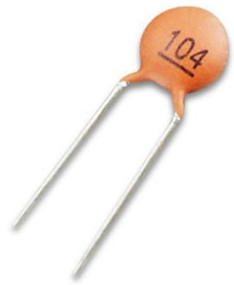</td>
    <td align="center">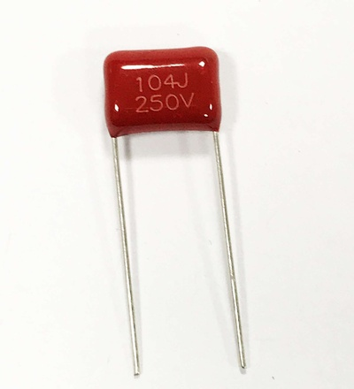</td>
   </tr>
   <tr>
    <td align="center">100 nF ceramic capacitor</td>
    <td align="center">100 nF polyester capacitor</td>
   </tr>
  </table>
  
  A 100 nF capacitor (ceramic or polyester), connected between the junction of the two resistors and the negative terminal of the battery, is used to stabilize the ADC reading by filtering out voltage fluctuations and electrical noise.
  <table align="center">
   <tr>
    <td align="center">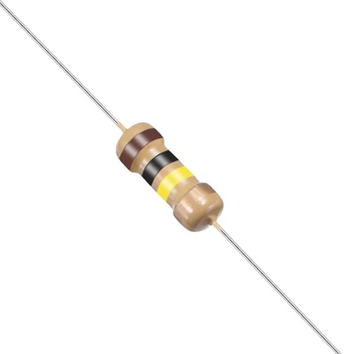</td>
    <td align="center">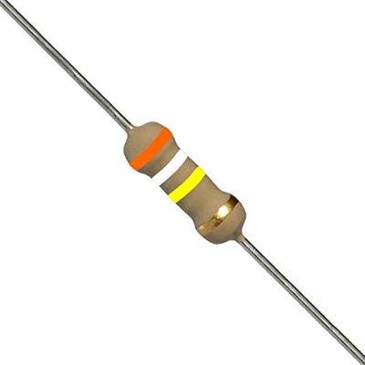</td>
   </tr>
   <tr>
    <td align="center">100 Kohm resistor 1/4 W 5%</td>
    <td align="center">390 Kohm resistor 1/4 W 5%</td>
   </tr>
  </table>
- **IR module** (optional)  
  This module is required if you want to control other *Power Functions* trains from the same web app provided by the MCU that directly controls the motor through the motor driver.
  <table align="center">
   <tr>
    <td align="center">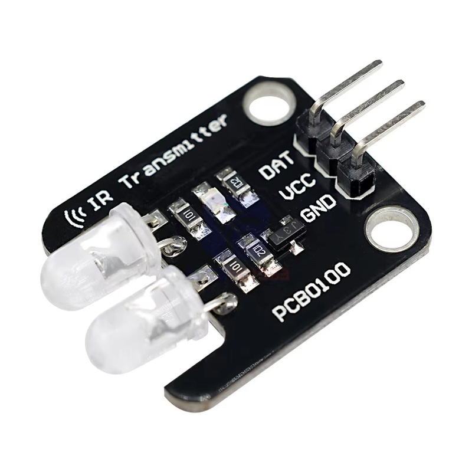</td>
   </tr>
   <tr>
    <td align="center">IR transmitter board PCB0100</td>
   </tr>
  </table>

## 3. How to wire the components
The following schematics show how to connect and wire the different components.
<p align="center">
  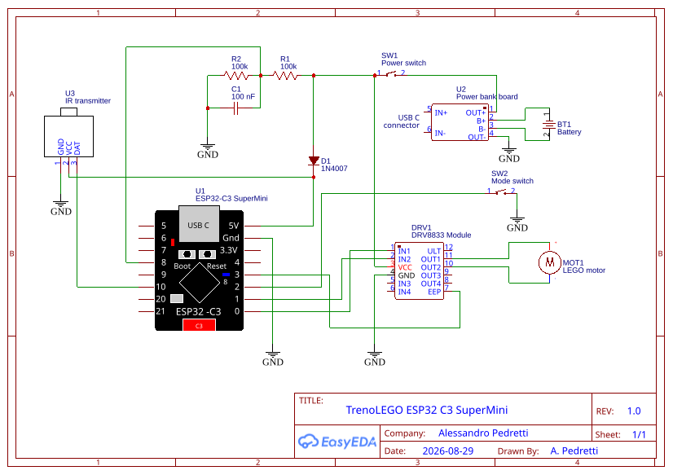
</p>

<p align="center">
  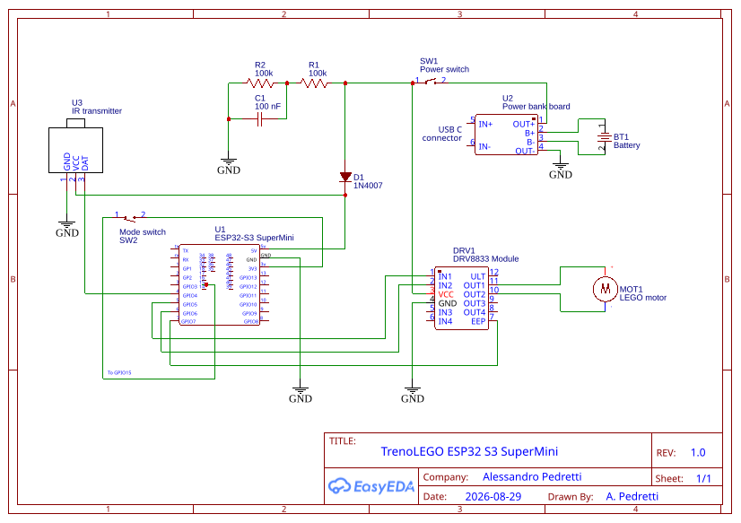
</p>

<p align="center">
  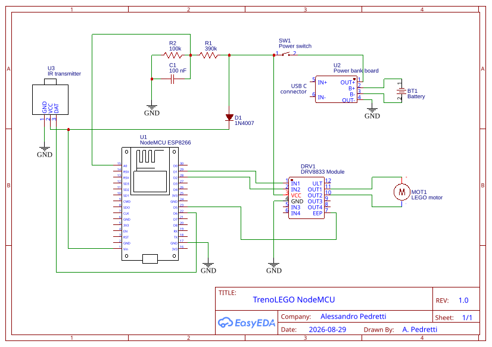
</p>

Here are examples of hubs built by me:

<table align="center">
   <tr>
     <td align="center" colspan="3"><b>Hub with PCB0100 IR board, built around a 18650 battery holder</b></td>
   </tr>
   <tr>
    <td align="center">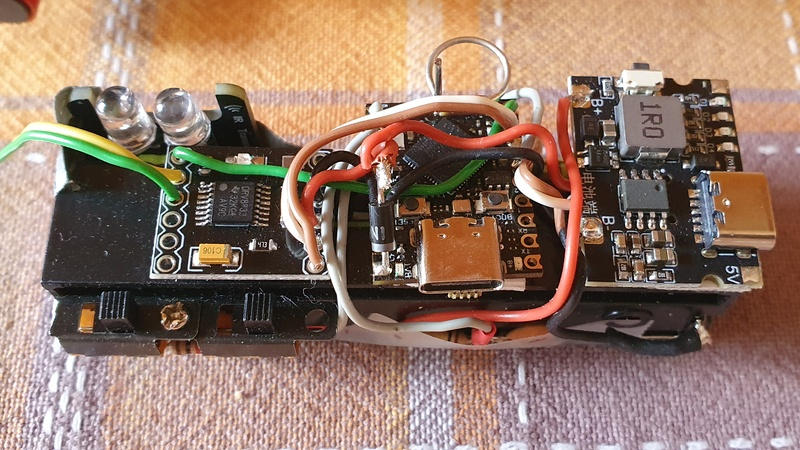</td>
    <td align="center">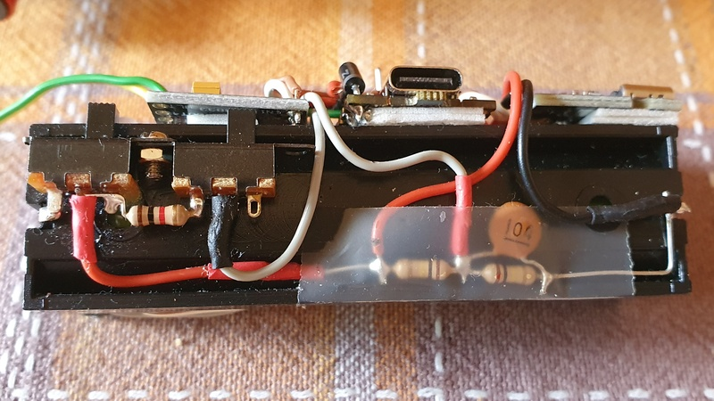</td>
    <td align="center">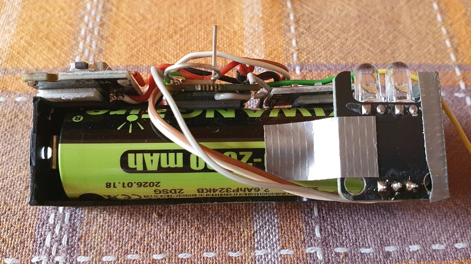</td>
   </tr>
   <tr>
    <td align="center">DRV8833, ESP32-S3 SuperMini with 1N4007 diode and the power bank circuit.</td>
    <td align="center">Power switch, mode switch and voltage divider made by two 100k resistor and 100 nF capacitor.</td>
    <td align="center">18650 battery and PCB0100 IR board. All parts are fixed by tape.</td>
   </tr>
   <tr>
    <td align="center">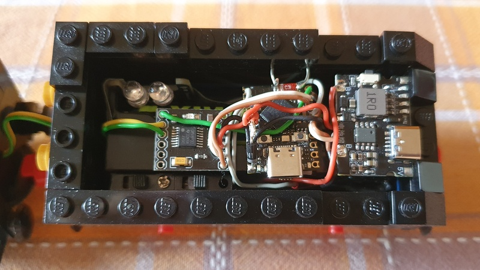</td>
    <td align="center">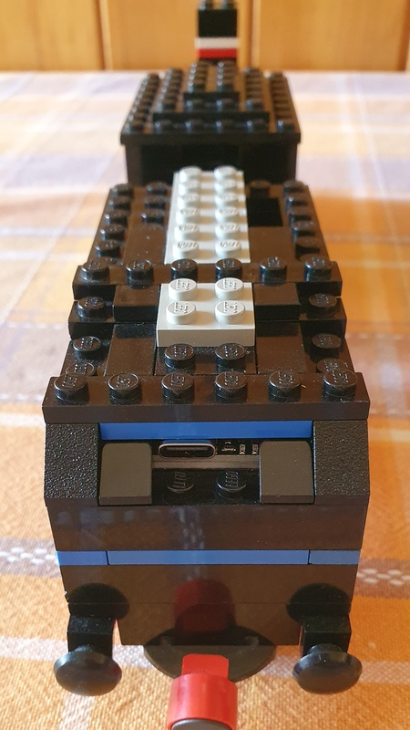</td>
    <td align="center">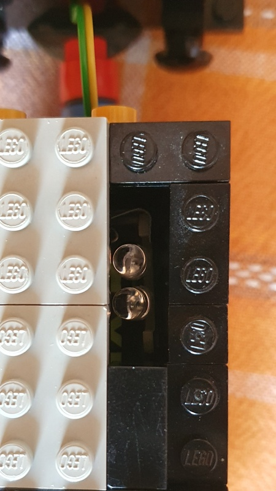</td>
   </tr>
   <tr>
    <td align="center">The hub inside a custom vintage tender.</td>
    <td align="center">The hole for USB-C connector to charge the battery.</td>
    <td align="center">The hole for the IR LEDs controlling <i>Power Functions</i> trains.</td>
   </tr>
</table>

## 4. Software requirements
To develop *TrenoLEGO*, I used *Arduino IDE* 1.8.19 rather than version 2.x, as the latest releases are too resource-intensive to run efficiently on my Chromebook using the Linux environment (*Crostini*). However, feel free to use a newer version of the *Arduino IDE* or any other compatible development environment.

The following libraries are required to build the project:

**For ESP32 C3 and S3:**
- *ESP32* board by Expressif Systems 2.0.11
- *Async TCP* by ESP32Async 3.4.10
- *Legoino* by Corneliun Munz 1.1.0
- *NimBLE-Arduino* by Ryan Powell 1.4.3

**For NodeMCU/ESP8266:**
- *ESP8266* board by ESP8266 Community 3.1.2 (only for ESP8266/NodeMCU)
- *ESP Async TCP* by ESP32Async 2.0.0

**For all targets:**
- *ArduinoJson* by Benoit Blanchon 7.4.3
- *CommandParser* by Anthony Zhang 1.1.1
- *ESP Async WebServer* by ESP32Async 3.10.3
- *ESP Telnet* by Lennart Hennings 2.2.3
- *FauxmoESP* by Paul Vint 3.4.1
- *IRremoteESP8266* by David Conran 2.9.0
- *PubSubClient* by Nick O'Leary 2.8.0
- *SimpleFTPServer* by Renzo Mischianti 3.0.2

**Patches for all ESP32**  
Edit the *FtpServerKey.h* file in the *~/Arduino/libraries/SimpleFTPServer/* and change:  
```
#define DEFAULT_STORAGE_TYPE_ESP32 					STORAGE_FFAT
```
to:
```
#define DEFAULT_STORAGE_TYPE_ESP32 					STORAGE_LITTLEFS
```

**Patches specific for ESP32 C3**  
In *patches* directory there are patched files of libraries and SDK for **ESP32 C3** target.
- **error_constants.h**  
  copy this file to *~/Arduino15/packages/esp32/tools/riscv32-esp-elf-gcc/esp-2021r2-patch5-8.4.0/riscv32-esp-elf/include/c++/8.4.0/bits*.
- **LegoinoCommon.h**  
  copy this file to *~/Arduino/libraries/Legoino/src*.

For Linux:
```bash
cd patches
cp error_constants.h ~/Arduino15/packages/esp32/tools/riscv32-esp-elf-gcc/esp-2021r2-patch5-8.4.0/riscv32-esp-elf/include/c++/8.4.0/bits
cp LegoinoCommon.h ~/Arduino/libraries/Legoino/src
```
  
For Windows:
```cmd
cd patches
copy error_constants.h "%LOCALAPPDATA%\Arduino15\packages\esp32\tools\riscv32-esp-elf-gcc\esp-2021r2-patch5-8.4.0\riscv32-esp-elf\include\c++\8.4.0\bits"
copy LegoinoCommon.h "%USERPROFILE%\Documents\Arduino\libraries\Legoino\src"
```

## 5. How to build the firmware and copy the required files into MCU file system
To build the firmware, you must install at least a [Arduino IDE 1.8.19](https://www.arduino.cc/en/software/) and the related software dependencies:  
- Install the toolchain:
  - To install  *ESP32* toolchain select *Tools -> Boards -> Boards Manager* main menu item, search for **esp32** by Expressivf System, select *2.0.11* as version and finally press *install* button. It is very important to choose the 2.0.11 toolchain version, otherwiese it will impossible to build the *Legoino* library.
  - To install *ESP8266* toolchain, select *File -> Preferences*, type *https://arduino.esp8266.com/stable/package_esp8266com_index.json* in *Additional Boards Manager URLs* and click *Ok* button. Open the *Boards Manager* (*Tools -> Boards -> Boards Manager*) search for **esp8266** by ESP8266 Community, select *3.1.2* as version and finally press *Install* button. This step is required if you intend to use ESP8266-based boards (e.g. NodeMCU).
- Install all libraries according to your MCU (see section 4) by *Library Manager* (*Sketch -> Include Library -> Manage Libraries*) and don't forget to patch the libraries (see the previous section).
- Rename *TrenoLEGO-main* directory to *TrenoLEGO*.
- Open *TrenoLEGO.ino* (*File -> Open*).
- Connect the MCU by USB cable.
- Select the comunication port: *Tools -> Port -> /dev/ttyUSBX* or *Tools -> Port -> /dev/ttyACMX* for Linux, *Tools -> Port -> COMX* for Windows, where *X* is the port number.
- Choose the board and its configuration:
  - **ESP32-C3 Supermini**
    - *Tools -> Board -> ESP32 Arduino -> ESP32C3 Dev Module*
    - *Tools -> CPU frequency -> 160MHz (WiFi)*
    - *Tools -> USB CDC On Boot -> Enabled*
    - *Tools -> Partition scheme -> Default 4MB with spiff (1.2MB APP / 1.5MB SPIFF)*
  - **ESP32-S3 Supermini**
    - *Tools -> Board -> ESP32 Arduino -> ESP32S3 Dev Module*
    - *Tools -> CPU frequency -> 240MHz (WiFi)*
    - *Tools -> USB CDC On Boot -> Enabled*
    - *Tools -> Partition scheme -> Default 4MB with spiff (1.2MB APP / 1.5MB SPIFF)*
    - *Tools -> PSRAM -> QSPI PSRAM* or *OPI PSRAM* for R8 chips
  - **ESP8266 NodeMCU**
    - *Tools -> Board -> ESP8266 Boards (3.1.2) -> NodeMCU 1.0 (ESP 12E Module)*
    - *Tools -> CPU frequency -> 160MHz*
- Upload the sketch (*Tools -> Upload*). This step may take some time, especially when building the sketch for the first time after starting the Arduino IDE.
- If the ESP32-S3 cannot enter programming mode automatically, hold the *BOOT* button, press and release *RESET*, and then release *BOOT*. Start the upload and press *RESET* again after programming if the board does not restart automatically.

To upload the files:
- Wait until the board LED stops flashing and remains solid blue, indicating that the MCU has entered *AP mode*.
- Connect your PC to the Wi-Fi network created by the MCU. The default SSID is *TrenoLEGO*, which corresponds to the default host name. This Wi-Fi network is not password-protected.
- Enter the *scripts* directory and run the *upload.py* script. On both Linux and Windows:

  ```bash
  cd scripts
  python3 upload.py
  ```

  If you are upgrading an existing *TrenoLEGO* hub, edit the *credentials.py* file first and set the host name and administrator credentials to match those currently configured on your device.


## 6. Configuration & usage
After the installation of the firmware, the copy of the system files and the wifi configuration you can explore the *graphic user interface* (GUI) of the web app just typing in your browser: http://trenolego  
The main page will be:
  
<table>
  <tr>
    <td valign="top">
      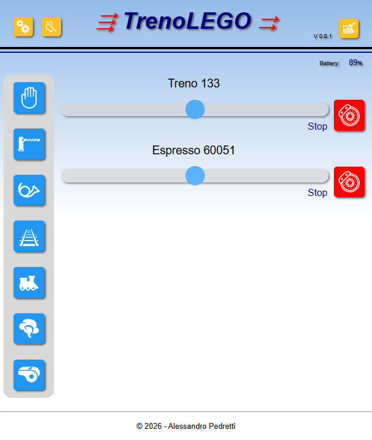
    </td>
    <td valign="top">
      <b>Playing with the train(s)</b><br>
At the top, three yellow buttons are displayed. Click the <i>gears</i> button to open the settings page (see below). Click the <i>speaker</i> button to turn the background music on or off. Click the <i>train</i> button to manually add other <i>TrenoLEGO</i> hubs by specifying their host name or IP address.<br>
The blue buttons can be used to play seven different sound effects. Use the sliders to control the speed and direction of each train. The red brake buttons stop the corresponding train.<br>
If you connect a <i>Bluetooth controller</i> to the device running the web browser, you can use it to control the trains and trigger sound effects according to the following scheme:
<br><br>
<p align="center">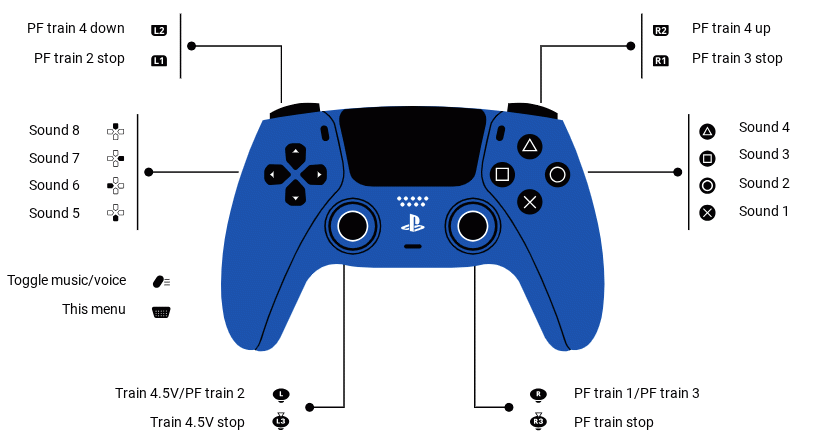</p><br>      
    </td>
  </tr>
</table>
  
Clicking the *gears* button, you open the **Configuration** page:
  
<table>
  <tr>
    <td valign="top">
      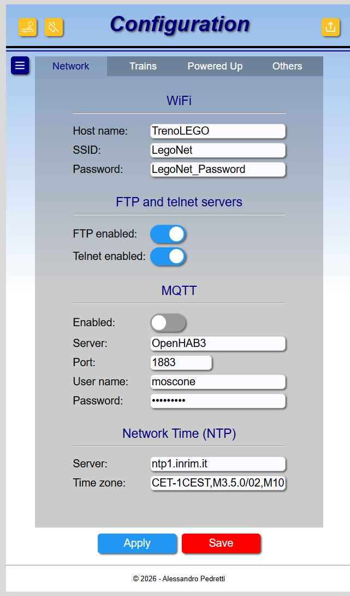
    </td>
    <td valign="top">
      <b>Network tab</b><br>
Here you can modify the <i>Host name</i> and Wi-Fi settings (<i>SSID</i> and <i>Password</i>), as well as enable or disable services such as <i>FTP</i> (required to update the GUI files), <i>Telnet</i> (which provides access to the remote console for debugging the firmware and changing settings), and <i>MQTT</i>. For the MQTT service, you can also configure the <i>Server</i>, <i>TCP port</i> (default: 1883), <i>User name</i>, and <i>Password</i>.<br>
Finally, you can configure the <i>Network time</i> settings (<i>Server</i> and <i>Time zone</i>), which are used to synchronize the MCU's internal clock and set the correct local time.
    </td>
  </tr>

  <tr>
    <td valign="top">
      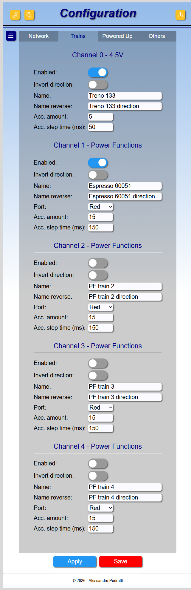
    </td>
    <td valign="top">
      <b>Trains tab</b><br>
In the <i>Trains</i> tab, you can configure the trains controlled by the hub. Five channels are available, numbered from 0 to 4. Channel 0 is reserved for the train whose motor is directly connected to the hub's motor driver. Channels 1 to 4 can be assigned to additional trains controlled via IR using the <i>Power Functions</i> protocol. Keep in mind that <i>Power Functions</i> trains can only be controlled if your hub is equipped with an IR module (e.g., PCB0100).<br>
Each channel/train can be enabled or disabled independently. For each train, you can invert the motor slider direction (<i>Invert direction</i>), specify the train <i>Name</i>, and define the alternative name used by <i>Alexa</i> to control the train in the opposite direction (<i>Name reverse</i>). You can also fine-tune the acceleration and braking behavior using the <i>Acc. amount</i> and <i>Acc. step time (ms)</i> parameters, providing smoother and more realistic speed changes when the motor slider is moved.<br>
For <i>Power Functions</i> channels/trains, you can also select the <i>Port</i> (<i>Red</i> or <i>Blue</i>) according to the output port of the IR receiver to which the motor is connected.
    </td>
  </tr>

  <tr>
    <td valign="top">
      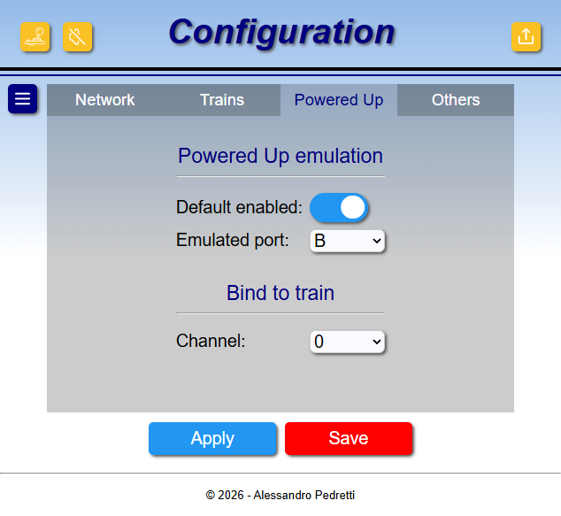
    </td>
    <td valign="top">
      <b>Powered Up emulation tab</b><br>
In this tab, you can configure the <i>Powered Up emulation</i> settings. You can define the behavior of the <i>mode switch</i> (<i>Default enabled</i>), select the <i>Emulated port</i> (<i>A</i> or <i>B</i>), and bind the emulated port to a specific train channel. In particular, <i>Powered Up emulation</i> can also be enabled for <i>Power Functions</i> trains, effectively creating a Bluetooth LE-to-IR bridge that allows them to be controlled as if they were <i>Powered Up</i> devices.
    </td>
  </tr>

  <tr>
    <td valign="top">
      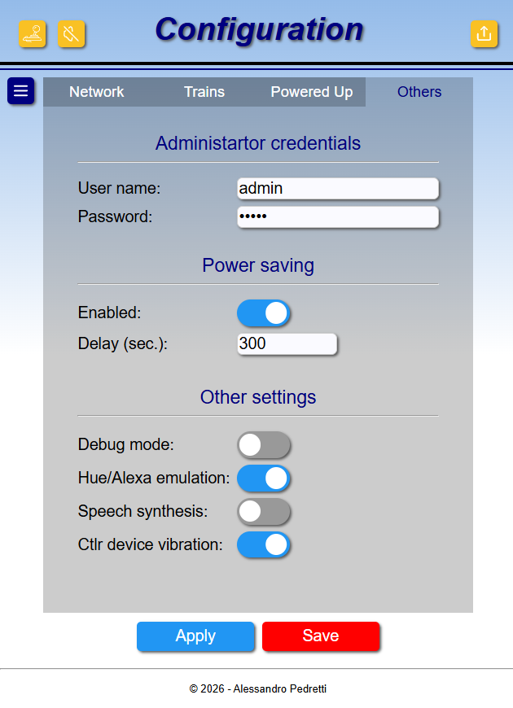
    </td>
    <td valign="top">
      <b>Others tab</b><br>
In the <i>Others</i> tab, you can change the <i>Administrator credentials</i> (<i>User name</i> and <i>Password</i>), which are required to access the configuration tabs and the <i>FTP</i> and <i>Telnet</i> services. You can also enable or disable <i>Power saving</i> and configure the corresponding inactivity timeout (<i>Delay (sec.)</i>), after which the system enters suspend mode. To resume the hub after suspension, you must turn it off and then back on.<br>
Finally, in the <i>Other settings</i> section, you can enable or disable <i>Debug mode</i>, <i>Hue/Alexa emulation</i>, <i>Speech synthesis</i> provided by the web browser, and haptic feedback for both the device running the web app and the gamepad.
    </td>
  </tr>
</table>

You can apply the settings temporarily or save them permanently by clicking the *Apply* and *Save* buttons, respectively.  
  
Clicking the *arrow-up* button, you open the **Firmware update** page:

<table>
  <tr>
    <td valign="top">
      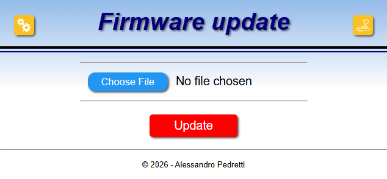
    </td>
    <td valign="top">
      <b>Firmware update</b><br>
From this page, you can update the hub firmware via OTA. Select the firmware file and click the <i>Update</i> button to start the update process. Once the update is successfully completed, the browser is automatically redirected to the main control page.<br><br>
<b>WARNINGS:</b><br>
      <ul>
       <li>If the firmware update fails, you may need to reinstall the firmware via a USB connection.</li>
       <li>When installing a new firmware version, the files stored in the file system should also be updated. See the previous section for instructions.</li>
      </ul>
    </td>
  </tr>
</table>

## 7. To do
- Step-by-step guide to insert all components into *88000-compatible* hub.
- Automatic recognition of the trains in the local net. In this way, you can control all the trains from the same web-app.
- Torque boost for a soft start of heavy trains.
- Simultaneus *PoweredUP* and advanced hub modes on ESP32-S3.
